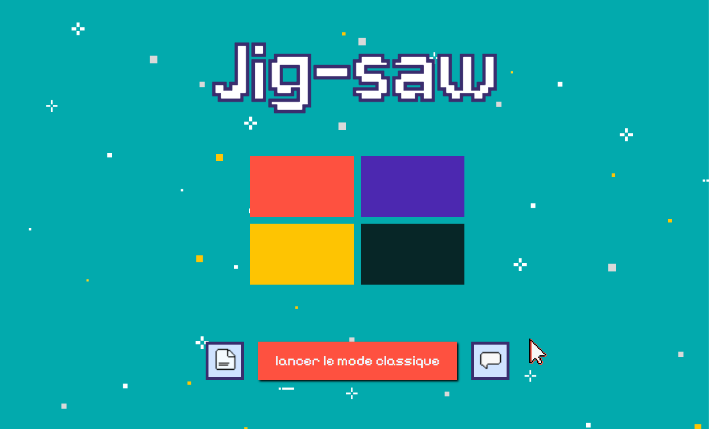

## 🖼️ Preview

  

  
  

# Jigsaw – Puzzle Glissant

Bienvenue dans le jeu Jigsaw !
Ce jeu est **un puzzle glissant** composé de **9 tuiles (3x3)** que vous devez réorganiser dans le bon ordre pour gagner.
Il est développé **en TypeScript et JavaScript, et s’inspire d’un thème rétro**, avec des sons 8-bit pour une ambiance nostalgique et ludique.

🎯 Objectif : Glissez les tuiles pour retrouver la séquence correcte.

## Fonctionnalités :
- Mélange aléatoire des pièces
- Compteur de déplacements
- Sons intégrés dans certaines actions du jeu
## Jouez ici : https://nbhd12.github.io/puzzlegame/index.html
*Amusez-vous bien et bon puzzle !*

---

## 🧩 Jigsaw – Sliding Puzzle (EN)

Welcome to **Jigsaw**, a **sliding puzzle** game built with **TypeScript** and **JavaScript**.

The puzzle contains **9 tiles (3x3)** that need to be arranged in the correct sequence to win.  
It features a **retro visual theme** and includes *8-bit sounds* for a nostalgic game feel.

## 🎮 Features
- Random shuffling of puzzle pieces  
- Move counter  
- Sound feedback integrated into certain actions  

## Play Now : https://nbhd12.github.io/puzzlegame/index.html
*Have fun solving the puzzle!*
